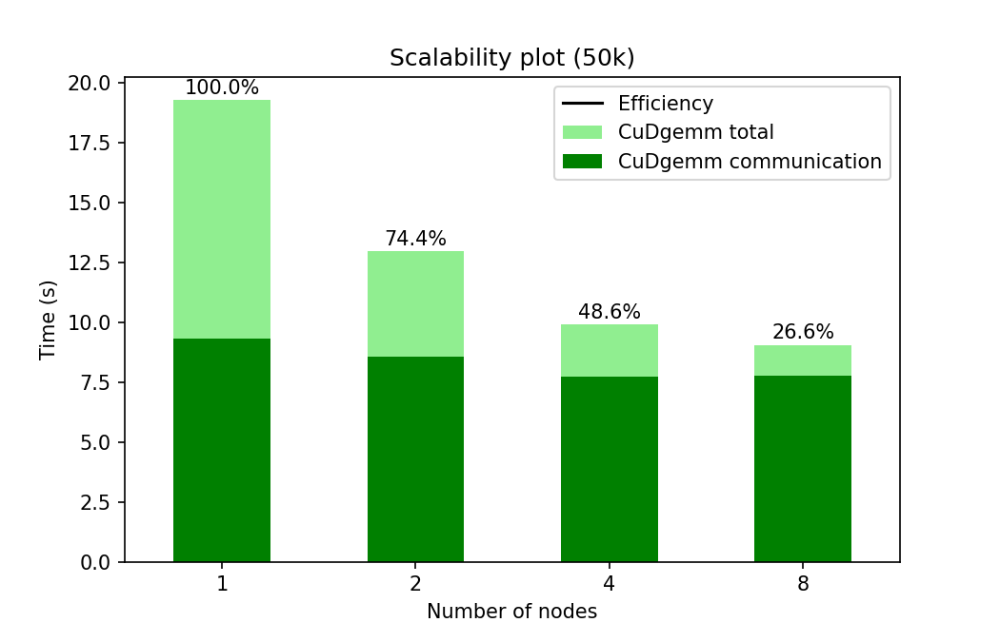

## Distributed matrix multiplication
The first goal is to multiply two matrices A and B that are distributed along the first dimension (rows) across several MPI processes. We need to perform the dot product between each row of A and each column of B. The rows of A are already local to the processes, but the columns of B are not. To reconstruct the columns of B we create a datatype and perform an MPI_Allgatherv() type of communication, so that each process receives the columns it needs. 

We also take care of the possible remainders when the number of processes is not a divisor of the size of the matrix. To do so, the datatype has to be recreated at each iteration of the loop over the number of column blocks.

The second goal is to replace the naive algorithm with a call to either the OpenBlas cblas_dgemm() (cpu) or the cuBLAS cublasDgemm() (gpu) libraries. We then perform a scalability study on 1, 2, 4 and 8 nodes of the Marconi100 cluster and also a comparison between the non-accelerated and the accelerated version of the code.

To simplify the debugging process, A is initialized with increasing integers numbers and B is the identity matrix so that C = A.

To compile the program on the Marconi100 cluster we have to load the following modules:
  - spectrum_mpi/10.4.0--binary
  - openblas/0.3.9--gnu--8.4.0
  - cuda/11.0

and then run either `make dgemm=1` or `make gpu=1`.

To run the program use `mpirun prod.x size print`, where size is the number of rows of the matrices and print must be either 1 or 0 depending on whether you want to print the result to terminal or not. You also may want to specify the number of MPI processes with the -np option.

## Benchmarks

