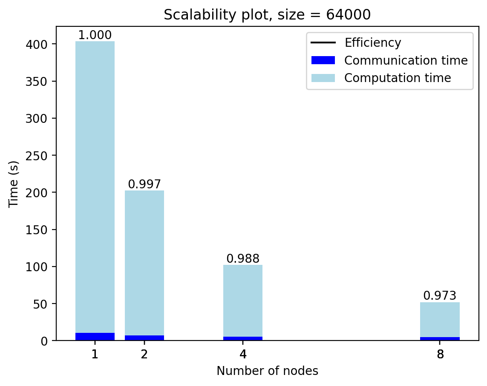
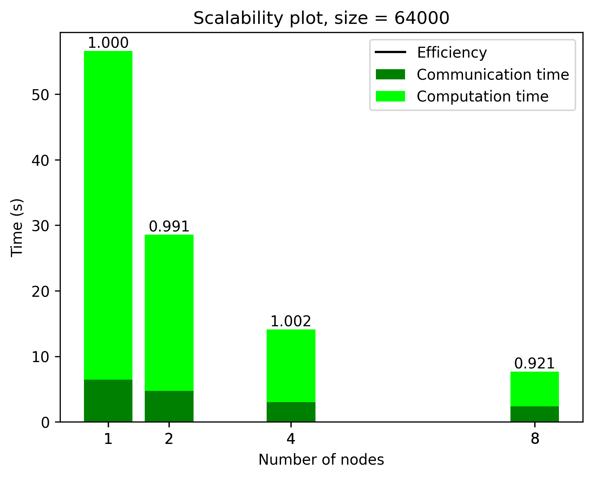
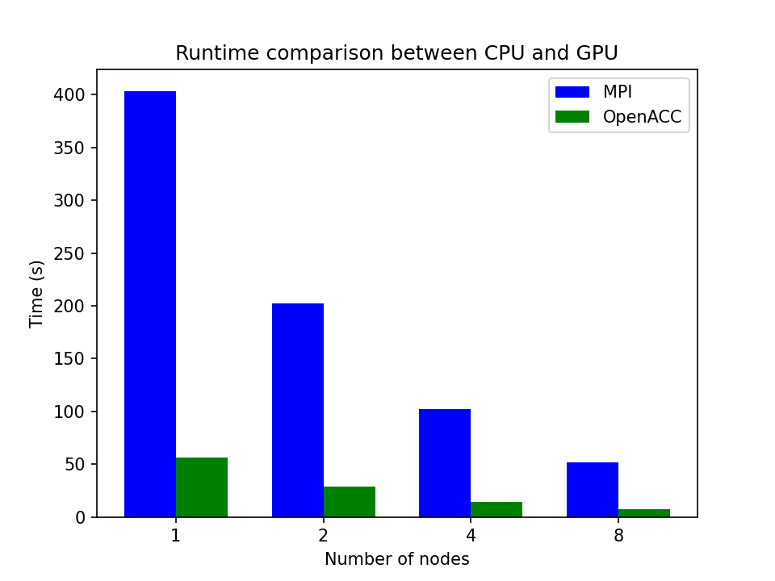

## Distributed and accelerated version of the Jacobi iteration

I performed a 1 dimensional domain decomposition of a square grid, with no periodic boundary conditions. Each chunk of the grid is then offloaded to a gpu via OpenACC. I used `MPI_Sendrecv()`, `#pragma acc update host()` and `#pragma acc update device()` to exchange the ghost rows between gpus at each iteration.

On the host I can avoid having to copy the new grid to the old by swapping the pointers at each iteration. On the other hand this does not work with OpenACC, so I used a different workaround: at each iteration I switch the arguments matrix and matrix_new in the function in which the evolution of the grid is performed (check utility.c).

The grid is saved to file only at the end; I did not exploit the parallel file system so the processes take turns in sending their chunk of the grid to the first one which saves the grid to a binary file.

The goal is to compute the efficiency of the non-accelerated and accelerated distributed versions of the code, and compare the runtime in the two cases.

## Solution

## Benchmarks
Here I show the scalability for 1000 iterations on the largest grid I could allocate on the gpus of a single node of the cluster (4x NVIDIA Tesla V100 16Gb). For a correct comparison the size is the same on the non accelerated version benchmark even though the host memory is much larger (256Gb). The scalability for smaller sizes is much worse, especially on the gpus. You can find those plots in the Plots folder.

### CPU scalability

### GPU scalability

### Comparison

